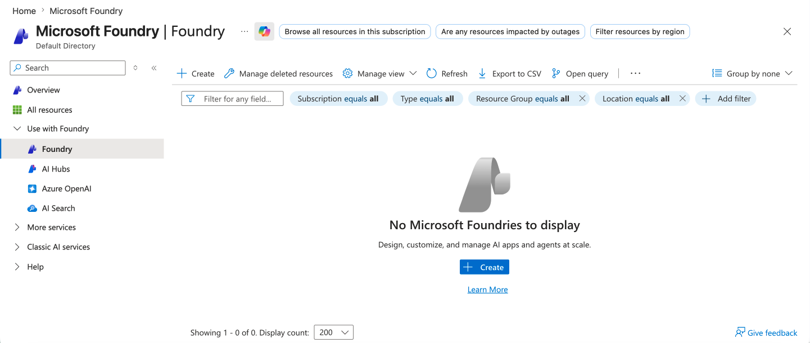
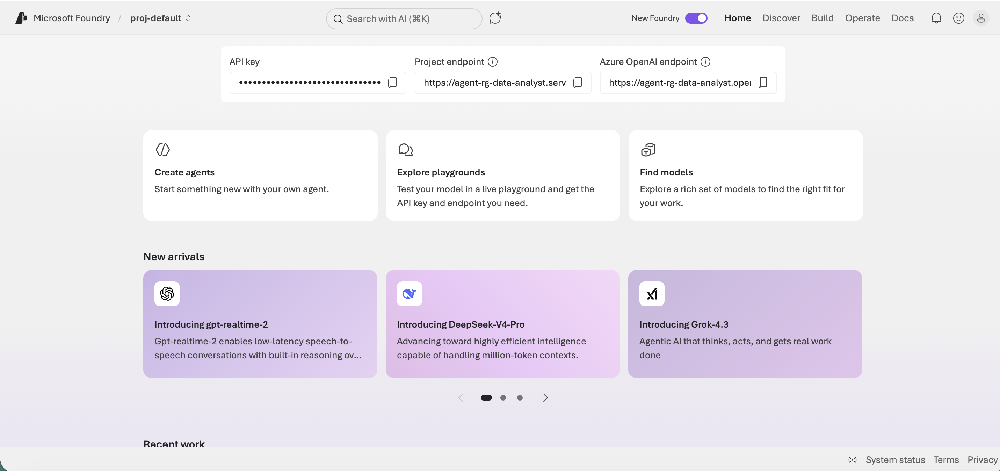
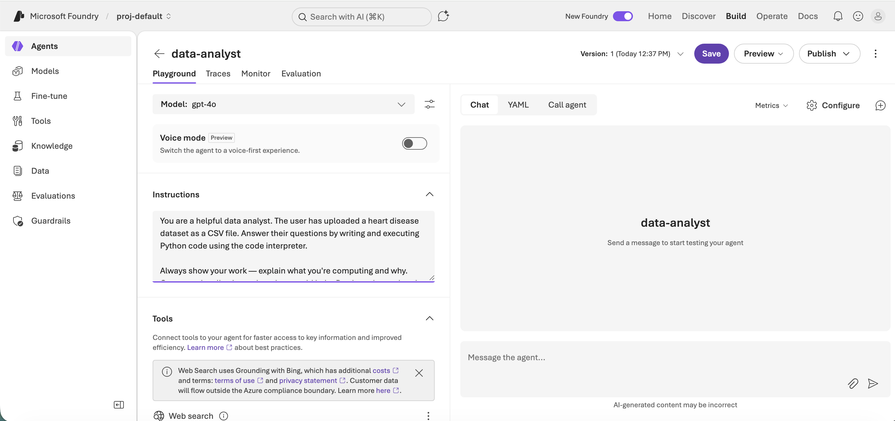

# Building an Agent in Azure AI Foundry

In this walkthrough, you'll build a **data analyst agent** in Azure AI Foundry. The agent will read a CSV file you give it, then answer natural-language questions about the data by writing and executing Python code on the fly.

This is a single, complete agentic system — and you'll build it without writing a line of code.

---

## 1. What is an agent?

An **agent** is an AI system that pursues a goal across multiple steps — choosing actions, using tools, and adjusting based on results — without a human in the loop for every step.

**Agent = LLM + Tools + Memory + Loop**

Concretely:
- **LLM** — the language model that reasons (in our case, **GPT-4o**).
- **Tools** — external capabilities the LLM can call. We'll give our agent one tool: a **code interpreter** that runs Python in a sandboxed environment.
- **Memory** — the conversation history (the *thread*) so the agent can build on previous turns.
- **Loop** — the agent doesn't just respond once. It can decide *"I need to run some code"*, see the result, then decide what to do next — possibly running more code, generating a chart, or asking you a clarifying question.

That last point is what makes this *agentic* rather than just *a chatbot*. Plain chat is one-shot Q&A. An agent decides, acts, observes, and continues.

---

## 2. What we'll build

A **Data Analyst Agent** that:

1. Has access to a CSV file (the heart disease dataset from the supervised learning notebook).
2. Accepts questions in plain English ("What's the average cholesterol level?", "Show me a histogram of age by target.").
3. Writes Python code to answer them.
4. Executes that code in a sandbox.
5. Returns the answer — often with a chart — back to you.

Internally, each question kicks off a multi-step loop:

```
You ask a question
  - Agent decides what code to write
  - Code interpreter runs it
  - Agent reads the output
  - If something looks off, agent writes new code and retries
  - Agent summarizes the final answer in plain English
```

You won't see most of this happening — you'll just see the final response. But that's what's going on under the hood.

---

## 3. Get the data ready

The cleaned `heart.csv` file is included in this lesson's folder. Download it to your local machine — you'll upload it into the Foundry agent in step 4.7.

It contains **297 patients × 14 columns**, already cleaned (UCI Cleveland heart disease dataset with missing rows dropped and the severity column binarized to `target`: `0` = no disease, `1` = has disease).

---

## 4. Build the agent in Azure AI Foundry

### Step 4.1 — Sign in to Azure AI Foundry

Sign in to the [Azure portal](https://portal.azure.com) with your Azure credentials, then search for **Microsoft Foundry**.

### Step 4.2 — Create a project

Foundry organizes work into *projects*. On the sidebar, click on **Foundry** and then **"+ Create"**.



Follow the prompts - ensure you select the correct subscription, create a new resource group, and name the project. When you are ready select **Review + create**, **Create**, and wait for the resource to deploy.

### Step 4.3 — Go to the Foundry Portal

Once the resource has deployed, go to the resource and select **Go to Foundry portal**.

### Step 4.4 — Create a new agent

Inside the portal, click on the **Create agents** option.

You'll be prompted to give the agent a name (such as `data-analyst`), and then select **Create**.



### Step 4.5 — Configure the agent

In the agent's configuration panel, fill in these fields:

| Field | Value |
|---|---|
| **Model** | `gpt-4o` |
| **Instructions** | (paste the prompt below) |

For the **Instructions** field, paste this system prompt:

```
You are a helpful data analyst. The user has uploaded a heart disease dataset
as a CSV file. Answer their questions by writing and executing Python code
using the code interpreter.

Always show your work — explain what you're computing and why. Generate
visualizations when they would help. Be clear about what the data does
and doesn't tell us.

The dataset contains clinical measurements for ~300 patients with these columns:
- age
- sex (1 = male, 0 = female)
- cp (chest pain type, 1–4)
- trestbps (resting blood pressure)
- chol (serum cholesterol)
- fbs (fasting blood sugar > 120, 1/0)
- restecg (resting ECG results)
- thalach (maximum heart rate)
- exang (exercise-induced angina, 1/0)
- oldpeak (ST depression)
- slope, ca, thal (other diagnostic measures)
- target (1 = has heart disease, 0 = does not)
```



### Step 4.6 — Enable the Code Interpreter tool

Find the **Tools** section and turn on **Code Interpreter**. This is the tool that lets the agent run Python.

### Step 4.7 — Upload the heart.csv file

Next to the **Code Interpreter** tool, there is an option to add files. Upload your `heart.csv` file. This attaches it to the agent so the code interpreter can read it.

### Step 4.8 — Save the agent

Click **Save**. Your agent is now live.

---

## 5. Try these questions

Open the **Chat** for your new agent and try these prompts one by one. After each, pay attention to:

- **What the agent says** — its plain-English answer.
- **What it does behind the scenes** — Foundry shows you the Python code it wrote and the output it got. Expand those panels to see.

### Question 1 — Simple statistic

> *"What's the average cholesterol level in this dataset?"*

Watch the agent: it reads the CSV, computes the mean, and reports a number.

### Question 2 — Comparison

> *"Compare the average age of patients with and without heart disease."*

Now it has to group, compute, and explain. Notice that the answer comes with a short interpretation, not just numbers.

### Question 3 — Visualization

> *"Show me a histogram of age, colored by whether the patient has heart disease."*

The agent should generate and display an actual chart.

### Question 4 — Multi-step reasoning

> *"Which features are most correlated with heart disease? Make a chart to support your answer."*

This is harder — the agent has to compute correlations across all features, sort them, and produce a visualization. It may take a few internal steps.

### Question 5 — Open-ended

> *"Give me a summary of this dataset. What should I know about it as a data analyst?"*

The agent will likely produce stats, distribution checks, and observations — essentially doing exploratory data analysis on your behalf.

---

## 6. Look behind the scenes

After running a few prompts, take a moment to see what the agent actually did. In the Foundry portal, select the **Traces** bar. Each agent response can be expanded to reveal:

- **The tool calls** the agent made (which tools it used, and in what order).
- **The Python code** it wrote and executed in the code interpreter.
- **The outputs** of those code executions — including any charts.

This is the agentic part of `LLM + Tools + Memory + Loop` made concrete. You can see the agent decide what to do, execute, observe the result, and continue in a single observable system.
